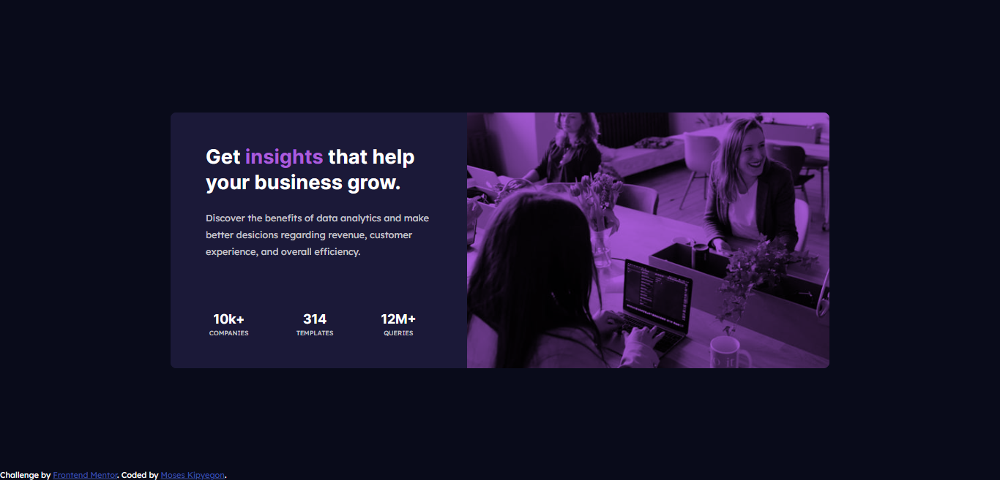

# Frontend Mentor - Stats preview card component solution

This is a solution to the [Stats preview card component challenge on Frontend Mentor](https://www.frontendmentor.io/challenges/stats-preview-card-component-8JqbgoU62). Frontend Mentor challenges help you improve your coding skills by building realistic projects. 

## Table of contents

- [Overview](#overview)
  - [The challenge](#the-challenge)
  - [Screenshot](#screenshot)
  - [Links](#links)
- [My process](#my-process)
  - [Built with](#built-with)
  - [What I learned](#what-i-learned)
  - [Continued development](#continued-development)
  - [Useful resources](#useful-resources)
- [Author](#author)
- [Acknowledgments](#acknowledgments)

## Overview

Seemed like a simple card but upon working on the mobile view then transitioning to the desktop view I realized I had not written my html markup well and had to redo it which came out superbly and at least was able to put in place a media query that is looking pretty in between different break points.
Going to reuse my media query for future projects as I was facing a challenge whereby the mobile view would break upon styling the dekstop.

### The challenge

Users should be able to:

Both mobile and desktop view done working mobile-first approach

### Screenshot




### Links

- Solution URL: [Add solution URL here](https://github.com/MosesKipyegon/stats-preview-card)
- Live Site URL: [Add live site URL here](https://your-live-site-url.com)

## My process

### Built with

- Semantic HTML5 markup
- CSS variables
- Flexbox
- Mobile-first workflow


### What I learned

How to place an image in a section through css and add an overlay colour over it.


```html
<div class="card__statistics">
        <div class="statistics--info">
          <span>10k+</span>
          <span>companies</span>
        </div>
        <div class="statistics--info">
          <span>314</span>
          <span>templates</span>
        </div>
        <div class="statistics--info">
          <span>12M+</span>
          <span>queries</span>
        </div>
</div>
```
```css
.card__image {
        width: 100vh;
        height: auto;
        max-width: 100%;
        background-position: center;
        background-size: cover;
        background-color: var(--acc-soft-violet);
        background-image: url(/images/image-header-desktop.jpg);
        background-blend-mode: multiply;
        border-radius: 0 .5em .5em 0;
    }
```


### Continued development

Use this section to outline areas that you want to continue focusing on in future projects. These could be concepts you're still not completely comfortable with or techniques you found useful that you want to refine and perfect.

### Useful resources

https://designmodo.com/statistics-ui-panel/ - This helped me with styling the stats on the card
https://www.mediacurrent.com/blog/how-build-card-component - This is an elaborate way of doing a good card 


## Author

- Website - [Moses Kipyegon](https://github.com/MosesKipyegon)
- Frontend Mentor - [@MosesKipyegon](https://www.frontendmentor.io/profile/MosesKipyegon)
- Twitter - [@yDihmoss](https://twitter.com/Dihmoss)


